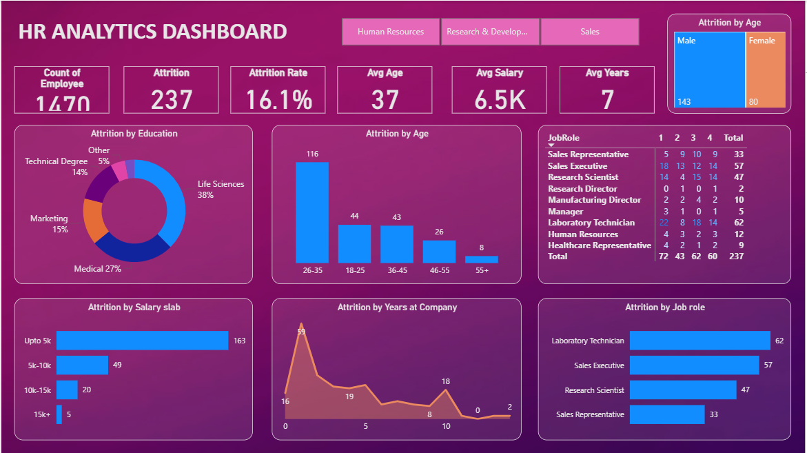

# HR Analytics Dashboard – Power BI Project

This project is an interactive HR Analytics Dashboard built using **Microsoft Power BI** to analyze and visualize employee attrition data. It showcases key HR metrics and provides insights to help stakeholders understand the underlying patterns and factors contributing to employee turnover.

## 📊 Key Features

- **Dynamic visualizations** for attrition trends across various dimensions such as:
  - Job roles
  - Education levels
  - Average salary
  - Work experience
- **Interactive filters** for drilling down into department-specific or demographic data
- **Predictive insights** using analytical techniques to estimate potential future attrition risks
- **User-friendly dashboard** layout designed for HR teams and leadership decision-making

## 🛠️ Tools & Technologies

- Microsoft Power BI
- Excel (data source and preprocessing)
- Data modeling and DAX for calculated insights

## 🚀 Purpose

This project demonstrates practical skills in:
- Data visualization
- Analytical thinking
- Business Intelligence using Power BI

## 📸 Dashboard Preview

